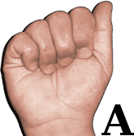
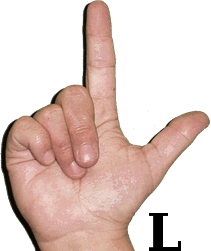

# Module 4 Final Project Overview

  

## Background

One of the great innovations in recent years has been machine translation using neural networks as the foundation.  This has:
* faciliated communication between countless millions of people who do not speak the same native language
* enabled students to learn new terminology
* emboldened travelers to interact with locals and "survive" in foreign environments
* allowed businessmen to broker deals that otherwise may have been very difficult decades ago (thus giving way to the age of globalization we're in now)

The common thread is that all languages are written, and that written input can be fed into a neural network and broken down into component pieces (sentences > words > syllables > letters).  This is of course the basis of translation, the ability to convert the written word from one language into another while retaining the meaning, sentiment and tone of the original text.

Google Translate and other similar machine translation engines perform fairly well at this task for a wide variety of languages.  However, there is one glaring weakness...what about languages that are not written?  There are some languages that are only passed down by spoken word and have no written form, although those generally have smaller speaking populations and may not have large markets of outsiders trying to communicate in the language.  The single largest blind spot is for a family of languages that is neither written nor verbally spoken, but instead understood by visual gestures only.  Sign Languages are spoken by well over 10 million people worldwide (estimates vary, with some sources indicating as many as 30 million).  This may very well be the most underrepresented segment of the global population when it comes to machine translation tools.

While we can't easily replicate the sophistication of a tool like Google Translate, we can attempt to provide a rudimentary tool that will leverage the power of neural networks as well.  Since sign language consists of visual gestures, we can use images (and perhaps in the future video segments) to train and create a predictive algorithm; in essence this a classification task with the goal of outputting a letter of the alphabet corresponding to an image input.  While this is only a small step towards being able to "translate" sign language, it can be an effective building block for new students to understand the ASL alphabet and to begin to translate short segments - this can later be extrapolated to larger components such as words and even full sentences.

## Introduction

In this project, I'll be working with image datasets consisting of American Sign Language alphabet letters.  Each image contains a person's hand formulating the corresponding alphabet letter against varied backgrounds.  The objective is to build a CNN that can accurately classify each image as a letter of the alphabet.

## Challenges
* Computational expense 
* Finding the "right" model architecture
* Reproducible results

## Methodology

* Loading and inspecting the data
* Building functions for repetitive tasks
* Optimizing and tuning model architecture
* Modeling, modeling, modeling...
* Evaluation and comparison of results

## Findings

* Our chosen network classified the unseen "real-world" data with about 40% accuracy

## Future Work

* With additional time and resources, vast improvement can likely be achieved via:

    * a more diverse and robust image dataset
    * additional experimentation with tuning model parameters
    
    

